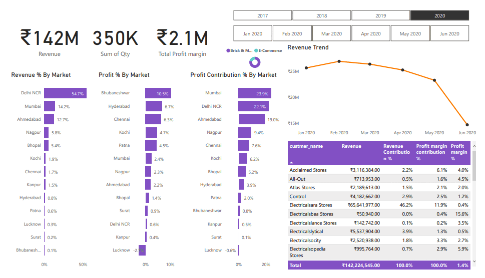

# Power_Bi-Projects

# 1. Sales Insight  
# Sales Insight Dashboard using Power BI

This project focuses on creating a Power BI dashboard to analyze sales data. The goal is to provide actionable insights for the sales director to make data-driven decisions and improve business performance.

---

## Project Overview
- **Objective**: Convert sales data into visual insights for better understanding and decision-making.  
- **Tools Used**: Power BI, MySQL, Power Query  

---

## Key Features
- Revenue, profit, and sales quantity analysis.
- Market and product performance breakdown.
- Trend analysis to identify declining and high-performing areas.  

---

## Outcome
The dashboard offers an intuitive way to analyze sales trends and market performance, helping stakeholders focus on critical business areas.

---

## Dashboard Preview

